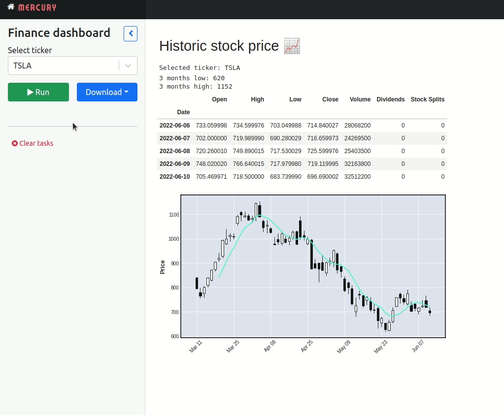
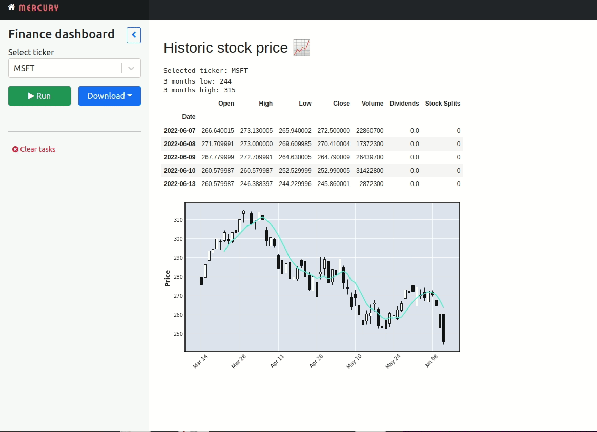

# Dashboard in Python with Jupyter Notebook

The finance dashboard was created in Python. The development was done with Jupyter Notebook. This website is serving notebook as web app. It is using MLJAR <a href="https://github.com/mljar/mercury" target="_blank">Mercury</a> framework.

## Links

Th web app is running at https://dashboard-jupyter-notebook.herokuapp.com/.

The article on <a href="https://mljar.com/blog/dashboard-python-jupyter-notebook" target="_blank">how to build a dashboard in Python with Jupyter Notebook</a>.

## Build dashboard with 9 lines of Python code

Let's start by creating an empty repository and cloning it:

```
git clone git@github.com:super999christ/jupyter-dashboard.git
```

Please setup the virtual environment:

```
virtualenv djenv
source djenv/bin/activate
```

I choose djenv as a name for virtual environment. I keep all required packages in the requirements.txt file:

```
mljar-mercury
mplfinance
yfinance

pip install -r requirements.txt

# add kernel
python -m ipykernel install --user --name djenv
```

We have environment ready, the next step is to start a Jupyter Notebook and create a new notebook. Please remember to select kernel with djenv name when creating a new notebook:

```
# starts Jupyter Notebook
jupyter notebook
```

## Dahsboard web app



## Export notebook to PDF 

